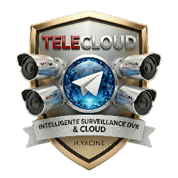

# TELECLOUD-MULTI 1.00v

<p align="center">
  
</p>

<p align="center">
  <strong>Multi-Channel DVR Recording Application with Stream Copy</strong>
</p>

<p align="center">
  <a href="#features">Features</a> •
  <a href="#installation">Installation</a> •
  <a href="#configuration">Configuration</a> •
  <a href="#building">Building</a> •
  <a href="#api-documentation">API</a>
</p>

---

## Overview

TELECLOUD-MULTI is a professional-grade, cross-platform application for recording RTSP video streams from DVR systems. Built with C++ and Qt 6, it provides **stream copy (remuxing)** functionality that transfers video data without any transcoding, ensuring **zero quality loss** and **minimal CPU usage**.

### Key Highlights

- **Stream Copy Technology**: No decoding/encoding - direct packet transfer
- **Multi-Codec Support**: H.264, H.265, H.265+, H.266 (VVC)
- **Cross-Platform**: Android 8.0-16.0 and Windows 10/11
- **Modern Dark Theme**: Professional UI with Qt Quick Controls 2
- **Automatic Detection**: Network scanning and camera discovery
- **Low Resource Usage**: Optimized for embedded and mobile devices

---

## Features

### 1. Network Scanner

- Scans IP range 192.168.0.1 to 192.168.255.254
- Automatic DVR brand detection (Hikvision, Dahua, Axis, etc.)
- Multi-threaded scanning for fast discovery
- Real-time progress reporting

### 2. RTSP Stream Probing

- Automatic codec detection (video and audio)
- Resolution and frame rate detection
- Bit rate analysis
- Channel count discovery (up to 64 channels)

### 3. Stream Copy Recording

| Feature | Description |
|---------|-------------|
| Video Codecs | H.264, H.265, H.265+, H.266 (VVC) |
| Audio Codecs | AAC, PCM, G.711 (A-law/μ-law), G.726 |
| Containers | MP4, MKV, TS, AVI |
| Quality | Lossless (no transcoding) |
| CPU Usage | Minimal (~1-5% per stream) |

### 4. File Management

- **Automatic Rotation**: Configurable segment duration (default 60 minutes)
- **Naming Convention**: `cam{numéro}_{JJ_MM_AA}h{HH}h{MM}m{SS}s.{ext}`
- **Example**: `cam1_06_02_26_10h02m00s.mp4`
- **Timezone**: UTC for consistency

### 5. User Interface

- **Dashboard**: Recording status, DVR info, codec display, storage stats
- **Configuration**: DVR settings, camera selection, storage path
- **Dark Theme**: Modern, eye-friendly design
- **Responsive**: Works on phones, tablets, and desktops

---

## Installation

### Android

1. Download the APK from [Releases](https://github.com/mirasmm9002-eng/telecloud-multi/releases)
2. Enable "Install from unknown sources" in settings
3. Install the APK
4. Grant required permissions:
   - Storage (for recordings)
   - Network (for RTSP streams)

**Requirements**:
- Android 8.0 Oreo (API 26) or higher
- ARM64 or ARMv7 processor
- ~50 MB free storage

### Windows

1. Download the ZIP package from [Releases](https://github.com/mirasmm9002-eng/telecloud-multi/releases)
2. Extract to desired location
3. Run `telecloud-multi.exe`

**Requirements**:
- Windows 10 (1809) or Windows 11
- x64 processor
- ~100 MB free storage

---

## Configuration

### dvr.json

The configuration is stored in `dvr.json`:

```json
{
  "appConfig": {
    "fps": 12,
    "segmentDurationMinutes": 60,
    "storageDirectory": "/path/to/recordings"
  },
  "dvrs": [
    {
      "id": "dvr-001",
      "ipAddress": "192.168.1.100",
      "port": 554,
      "username": "admin",
      "password": "encrypted_password",
      "cameras": [...]
    }
  ]
}
```

### RTSP URL Patterns

| Brand | Pattern |
|-------|---------|
| Hikvision | `rtsp://IP:554/Streaming/Channels/{ch}01` |
| Dahua | `rtsp://IP:554/cam/realmonitor?channel={ch}&subtype=0` |
| Axis | `rtsp://IP:554/axis-media/media.amp?camera={ch}` |
| Reolink | `rtsp://IP:554/h264Preview{ch}_main` |
| TP-Link | `rtsp://IP:554/stream{ch}` |

---

## Building

### Prerequisites

- **Qt 6.6+** with modules: Core, Quick, Network, Concurrent
- **FFmpeg 6.0+** libraries (libavformat, libavcodec, libavutil)
- **CMake 3.16+**
- **C++17 compiler**

### Build on Linux

```bash
# Install dependencies
sudo apt install qt6-base qt6-declarative qt6-network libavformat-dev libavcodec-dev

# Clone repository
git clone https://github.com/mirasmm9002-eng/telecloud-multi.git
cd telecloud-multi

# Build
mkdir build && cd build
cmake ../src -DCMAKE_BUILD_TYPE=Release
make -j$(nproc)
```

### Build for Android

```bash
# Install Android SDK, NDK, and Qt for Android
export ANDROID_HOME=/path/to/android-sdk
export ANDROID_NDK=/path/to/android-ndk

# Build
mkdir build-android && cd build-android
cmake ../src \
  -DCMAKE_TOOLCHAIN_FILE=$ANDROID_NDK/build/cmake/android.toolchain.cmake \
  -DANDROID_ABI=arm64-v8a \
  -DQt6_DIR=/path/to/qt/android_arm64_v8a/lib/cmake/Qt6
make -j$(nproc)

# Create APK
/path/to/qt/android_arm64_v8a/bin/androiddeployqt ...
```

### Build on Windows

```powershell
# Using Visual Studio 2022
cmake -G "Visual Studio 17 2022" -A x64 ../src
cmake --build . --config Release

# Deploy Qt libraries
windeployqt Release/telecloud-multi.exe
```

### GitHub Actions

The project includes automated CI/CD workflows:

- **build-android.yml**: Builds APK for arm64-v8a and armeabi-v7a
- **build-windows.yml**: Builds EXE with installer

Push to `main` branch or create a version tag to trigger builds.

---

## API Documentation

### Backend Classes

#### NetworkScanner
```cpp
// Scan network for DVRs
NetworkScanner scanner;
connect(&scanner, &NetworkScanner::dvrFound, this, &MyClass::onDVRFound);
scanner.startScan();
```

#### RTSPProbe
```cpp
// Probe RTSP stream for information
RTSPProbe probe;
RTSPProbeResult result = probe.probe("rtsp://192.168.1.100:554/stream1");
qDebug() << "Codec:" << result.streamInfo.videoCodecName;
```

#### Recorder
```cpp
// Start recording
RecordingConfig config;
config.rtspUrl = "rtsp://...";
config.cameraNumber = 1;
config.segmentDurationMinutes = 60;

Recorder recorder;
recorder.startAll({config});
```

#### DVRManager
```cpp
// Manage DVR configuration
DVRManager manager;
manager.loadConfiguration();
auto dvrs = manager.getAllDVRs();
manager.saveConfiguration();
```

#### ErrorLogger
```cpp
// Log errors (singleton)
ErrorLogger::instance().logError("CODE001", "Error message", "Context");
```

---

## Project Structure

```
telecloud-multi/
├── src/
│   ├── core/              # C++ backend classes
│   │   ├── errorlogger.h/cpp
│   │   ├── networkscanner.h/cpp
│   │   ├── rtspprobe.h/cpp
│   │   ├── recorder.h/cpp
│   │   └── dvrmanager.h/cpp
│   ├── ui/                # QML interface files
│   │   ├── main.qml
│   │   ├── styles/Theme.qml
│   │   ├── pages/
│   │   │   ├── DashboardPage.qml
│   │   │   └── ConfigurationPage.qml
│   │   └── components/Card.qml
│   ├── main.cpp
│   └── CMakeLists.txt
├── android/               # Android-specific files
│   ├── AndroidManifest.xml
│   ├── build.gradle
│   └── res/
├── windows/               # Windows DLLs
├── .github/workflows/     # CI/CD workflows
├── dvr.json.example
├── Icon.png
└── README.md
```

---

## Supported DVR Brands

| Brand | RTSP Detection | Channel Discovery | H.265+ Support |
|-------|---------------|-------------------|----------------|
| Hikvision | ✅ | ✅ | ✅ |
| Dahua | ✅ | ✅ | ✅ |
| Axis | ✅ | ✅ | ✅ |
| Bosch | ✅ | ✅ | ✅ |
| Reolink | ✅ | ✅ | ✅ |
| TP-Link/Tapo | ✅ | ✅ | ✅ |
| Uniview | ✅ | ✅ | ✅ |
| Sony | ✅ | ✅ | ✅ |
| Samsung/Hanwha | ✅ | ✅ | ✅ |
| Panasonic | ✅ | ✅ | ✅ |
| Vivotek | ✅ | ✅ | ✅ |
| Honeywell | ✅ | ✅ | ✅ |
| Generic | ✅ | ✅ | ✅ |

---

## Troubleshooting

### Common Issues

**Recording won't start**
- Verify RTSP URL works in VLC media player
- Check credentials are correct
- Ensure network connectivity to DVR

**High CPU usage**
- Should not happen with stream copy
- Verify no transcoding is occurring
- Check FFmpeg library version

**Android storage permission denied**
- Go to Settings > Apps > TELECLOUD-MULTI > Permissions
- Enable "Allow all the time" for storage

**No cameras detected**
- Verify DVR is on same network
- Check if RTSP port (554) is open
- Try manual IP address entry

---

## License

This project is licensed under the MIT License - see the LICENSE file for details.

---

## Contributing

Contributions are welcome! Please read CONTRIBUTING.md for guidelines.

---

## Support

- **Issues**: [GitHub Issues](https://github.com/mirasmm9002-eng/telecloud-multi/issues)
- **Discussions**: [GitHub Discussions](https://github.com/mirasmm9002-eng/telecloud-multi/discussions)

---

<p align="center">
  <strong>TELECLOUD-MULTI</strong> - Professional DVR Recording Solution
</p>
